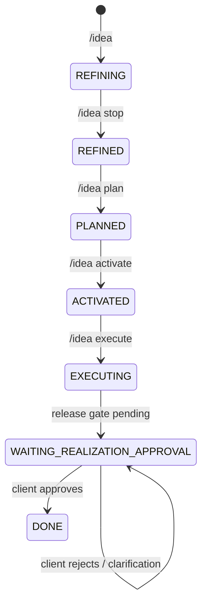
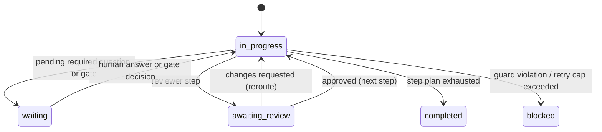

# AIAgentsWorkflow

Human-centered AI SDLC workflow with deterministic orchestration, explicit governance gates, and Telegram-based client collaboration.

This repository is organized around **Version2** as the active workflow runtime.

## What this project is

This project is not just a coding bot. It is a workflow system for running software delivery with AI role orchestration while preserving human ownership.

The workflow is designed so that:
- Human engineer/client keeps authority over intent and release decisions.
- AI agents execute role work in a repeatable SDLC sequence.
- Runtime state is explicit, auditable, and resumable.
- Every transition is validated against schemas and hard guards.

## Version2 at a glance

Version2 introduces a profile-driven orchestrator and separates concerns clearly:
- Workflow definition: `Version2/agent_runtime/workflow_profiles/*.yaml`
- Runtime state: `Version2/agent_runtime/status.json`
- Tooling: `Version2/tools/src/orchestrator/*`
- Role charters: `Version2/.windseruf/workflows/*.md`
- Idea context and lifecycle: `Version2/agent_runtime/ideas/*.md`, `Version2/agent_runtime/plugin/context*.md`
- Bot bridge (Telegram): `agent_runtime/steward_ai_zorba_bot/`

## Repository map

- `Version2/`
  - `.windseruf/workflows/`: role charters used by orchestration
  - `agent_runtime/`: schemas, rules, status, ideas, plugin context, artifacts
  - `tools/src/orchestrator/`: orchestrator engine and runtime modules
  - `tools/tests/orchestrator/`: orchestrator unit and behavior tests
  - `implementations/<idea_id>/`: realization workspaces per idea
- `agent_runtime/steward_ai_zorba_bot/`
  - Telegram communication bridge for `/idea` lifecycle and approval loop

## Core runtime contracts

### 1. Single runtime truth
- `Version2/agent_runtime/status.json` is the authoritative state for orchestration.

### 2. Single active problem definition
- `Version2/agent_runtime/plugin/context.md` contains active context front matter.
- `idea_id` in `context.md` binds orchestration to the active idea.

### 3. Per-idea idea storage
- Each idea is stored as `Version2/agent_runtime/ideas/<idea_id>.md`.

### 4. Per-idea evidence isolation
- Orchestrator artifacts and traces are written to:
  - `Version2/agent_runtime/artifacts/<idea_headline_slug>/`

## State machines

### Idea lifecycle state machine



Current idea states in runtime:
- `NEW`
- `REFINING`
- `REFINED`
- `PLANNED`
- `ACTIVATED`
- `EXECUTING`
- `WAITING_REALIZATION_APPROVAL`
- `DONE`

### Orchestrator step state machine

Orchestrator step cursor is stored in:
- `current_step_index`
- `current_phase`
- `current_role`

And execution status is tracked by:
- `phase_status`: `not_started | in_progress | waiting | awaiting_review | completed | blocked`
- `role_status`: `not_started | in_progress | completed`
- `review_status`: `not_started | in_review | approved | changes_requested`
- `realization_status`: `not_started | executing | waiting_approval | approved | rejected | completed`



## Profiles and execution modes

Workflow profiles define phase plans and gates:
- `default_fallback_profile` (simulation mode, compatibility baseline)
- `smartbookmarker_realization` (realization mode with workspace/git enforcement)

Profile selection order:
1. Explicit command: `/orchestrator @<profile>`
2. Environment: `ORCHESTRATOR_PROFILE`
3. Default fallback: `default_fallback_profile`

Execution modes:
- `simulation`: deterministic artifact production, no real product implementation required
- `realization`: role execution delegated into `Version2/implementations/<idea_id>/adapter/role_adapter.py`

## How orchestration is triggered

The orchestrator tool entrypoint is:
- `Version2/tools/src/orchestrator/main.py`

Primary commands:
- `list-profiles`
- `validate-profile`
- `init`
- `run`
- `step`
- `set-gate`
- `validate-status`
- `trigger`

Agent-style trigger example:

```bash
python Version2/tools/src/orchestrator/main.py trigger '/orchestrator @smartbookmarker_realization'
```

## Telegram bot responsibilities

The bot in `agent_runtime/steward_ai_zorba_bot/` handles:
- Idea lifecycle commands (`/idea ...`)
- Delivery of orchestrator human gate questions
- Mapping human approval/rejection answers back to `status.json`
- Resuming orchestrator execution after approval

It is the communication bridge between client and live AI workflow.

## Quick start

### 1. Environment

Set bot environment in:
- `agent_runtime/steward_ai_zorba_bot/.env`

Critical values:
- `AGENT_RUNTIME_DIR=Version2/agent_runtime`
- `ORCHESTRATOR_PROFILE=default_fallback_profile` or `smartbookmarker_realization`
- Telegram and AI provider credentials

### 2. Run bot

```bash
cd agent_runtime/steward_ai_zorba_bot
python3 -m venv .venv
source .venv/bin/activate
python -m pip install -r requirements.txt
python -u main.py
```

### 3. From Telegram

Typical flow:
1. `/idea <headline>`
2. Brainstorm with GPT
3. `/idea stop`
4. `/idea plan <id>`
5. `/idea activate <id>`
6. `/idea execute <id>`
7. Reply `approve` / `yes` / `1` when release gate question arrives

## Quality and guardrails

Built-in controls include:
- Schema validation for profiles and status
- Illegal transition rejection
- Required-output enforcement
- Review-cycle cap with escalation
- Explicit gate handling for human decisions
- Commit protocol enforcement in realization mode
- Per-idea trace and artifact isolation

## Testing

Run orchestrator tests:

```bash
pytest -q Version2/tools/tests/orchestrator
```

Run Version2 tests:

```bash
pytest -q Version2/tests
```

Run steward bot tests:

```bash
pytest -q agent_runtime/steward_ai_zorba_bot/tests
```

## Suggested reading order

1. `on-boarding.md`
2. `Version2/README.md`
3. `Version2/agent_runtime/rules/workflow_protocol.md`
4. `Version2/agent_runtime/rules/state_model.md`
5. `Version2/tools/README.md`
