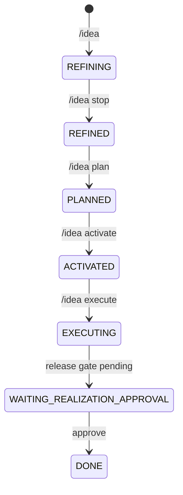
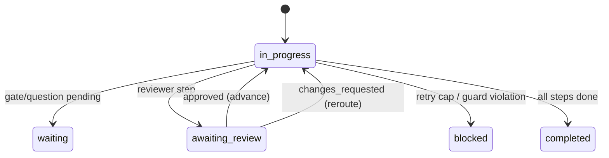

# On-boarding: Version2 Workflow

This guide is the practical story of how a new engineer joins this project, understands the moving parts, and safely runs the full AI-agent SDLC flow.

## 1. The story in one page

You are the human engineer and product owner for a new idea.

Your job:
- define intent,
- keep quality/risk ownership,
- approve release.

The agents' job:
- execute SDLC roles step-by-step,
- produce auditable artifacts,
- ask you only when a hard gate requires human input.

The bot's job:
- keep communication always-on between you and the workflow runtime.

The orchestrator's job:
- enforce deterministic transitions,
- reject illegal states,
- never silently skip required outputs or gates.

## 2. Mental model

Think in four layers:

1. Intent layer
- Active problem definition lives in `Version2/agent_runtime/plugin/context.md`.
- `idea_id` is the binding key.

2. Lifecycle layer
- Idea files live in `Version2/agent_runtime/ideas/<idea_id>.md`.
- Idea lifecycle transitions are command-driven (`/idea ...`).

3. Orchestration layer
- Runtime state lives in `Version2/agent_runtime/status.json`.
- Phase plan comes from selected profile YAML.

4. Evidence layer
- Artifacts and traces land under:
  - `Version2/agent_runtime/artifacts/<idea_headline_slug>/`

## 3. The two state machines you must know

### A. Idea lifecycle



### B. Workflow execution



Status fields you will inspect most:
- `current_phase`
- `current_role`
- `current_step_index`
- `phase_status`
- `review_status`
- `realization_status`
- `pending_human_gate_id`
- `pending_human_question_id`

## 4. Day-1 setup

### Prerequisites
- Python 3.8+ available
- Telegram bot token and allowed user ID
- AI provider key
- If realization with Google Sheets checks: valid service account credentials

### Configure bot runtime

File:
- `agent_runtime/steward_ai_zorba_bot/.env`

Critical fields:
- `AGENT_RUNTIME_DIR=Version2/agent_runtime`
- `ORCHESTRATOR_PROFILE=default_fallback_profile` or `smartbookmarker_realization`
- `TELEGRAM_BOT_TOKEN=...`
- `TELEGRAM_ALLOWED_USER_IDS=...`
- `AI_API_KEY=...`

### Start bot

```bash
cd agent_runtime/steward_ai_zorba_bot
python3 -m venv .venv
source .venv/bin/activate
python -m pip install -r requirements.txt
python -u main.py
```

Expected startup behavior:
- bot listens on Telegram
- polls `status.json` for pending questions
- restores active REFINING sessions if any

## 5. First complete run (happy path)

From Telegram:

1. `/idea expense tracker`
2. Brainstorm with GPT
3. `/idea stop`
4. `/idea plan expense_tracker`
5. `/idea activate expense_tracker`
6. `/idea execute expense_tracker`

What should happen:
- orchestrator initializes from active context `idea_id`
- runs role steps according to profile
- pauses at `RELEASE_APPROVAL`
- sends approval question to you

You reply:
- `approve` or `yes` or `1`

Then:
- gate is marked approved
- orchestrator completes remaining step(s)
- idea transitions to `DONE`
- runtime reaches `realization_status=completed`

## 6. Where to look when something is wrong

### If `/idea execute` fails immediately
Check:
- `context.md` includes `idea_id`
- idea status is `ACTIVATED`
- `AGENT_RUNTIME_DIR` points to `Version2/agent_runtime`
- orchestrator entrypoint exists in `Version2/tools/README.md`

### If workflow blocks early
Check:
- `status.json` `blocking_reasons`
- missing required artifacts in `status.json.artifacts`
- unresolved required questions

### If gate question is not delivered
Check:
- `status.json.questions[]` has `pending_delivery` or `delivered`
- bot process is running
- telegram credentials and user allowlist

### If realization loop fails in integration
Check:
- `Version2/agent_runtime/artifacts/<slug>/integration_test_report.md`
- `role_attempts`
- `integration_loop_status`
- `integration_failure_target`

## 7. Files you should know by heart

### Runtime and contracts
- `Version2/agent_runtime/status.json`
- `Version2/agent_runtime/schemas/status.schema.json`
- `Version2/agent_runtime/workflow_profiles/default_fallback_profile.yaml`
- `Version2/agent_runtime/workflow_profiles/smartbookmarker_realization.yaml`
- `Version2/agent_runtime/rules/workflow_protocol.md`
- `Version2/agent_runtime/rules/state_model.md`

### Orchestrator
- `Version2/tools/src/orchestrator/main.py`
- `Version2/tools/src/orchestrator/state_machine.py`
- `Version2/tools/src/orchestrator/role_executor.py`
- `Version2/tools/src/orchestrator/workspace_bootstrap.py`
- `Version2/tools/src/orchestrator/git_protocol.py`

### Human communication bridge
- `agent_runtime/steward_ai_zorba_bot/apps/telegram/idea_chat.py`
- `agent_runtime/steward_ai_zorba_bot/services/idea_handler.py`
- `agent_runtime/steward_ai_zorba_bot/services/status_handler.py`

## 8. Commands reference

### Telegram `/idea` commands
- `/idea`
- `/idea <headline>`
- `/idea start <id>`
- `/idea continue <id>`
- `/idea stop`
- `/idea list`
- `/idea plan <id>`
- `/idea activate <id>`
- `/idea execute <id>`
- `/idea done <id>`

### Orchestrator CLI
- `python Version2/tools/src/orchestrator/main.py list-profiles`
- `python Version2/tools/src/orchestrator/main.py validate-profile default_fallback_profile`
- `python Version2/tools/src/orchestrator/main.py init '/orchestrator @default_fallback_profile'`
- `python Version2/tools/src/orchestrator/main.py run --status-file Version2/agent_runtime/status.json`
- `python Version2/tools/src/orchestrator/main.py trigger '/orchestrator @smartbookmarker_realization'`

## 9. Engineering guardrails

When changing Version2:
- Keep orchestrator transition authority only in `state_machine.py`.
- Keep status/profile schema contracts strict.
- Avoid duplicating path/validation logic across modules.
- Prefer deterministic behavior over hidden heuristics.
- Add tests for every bug fix that affects transitions or file paths.

## 10. Production-readiness checklist

Before shipping:
- all orchestrator tests pass
- bot tests pass
- profile and status schema validation pass
- one end-to-end execute/approval flow verified
- artifacts generated under correct per-idea folder
- no secrets committed
- docs updated for any command or contract change
